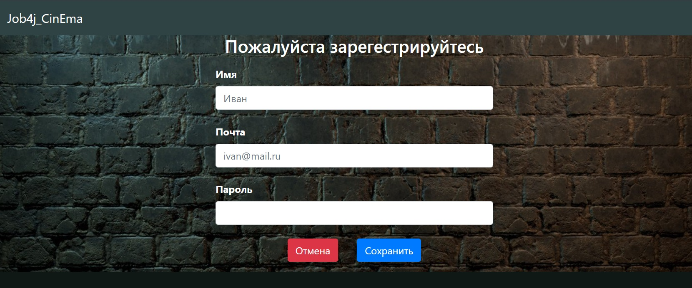
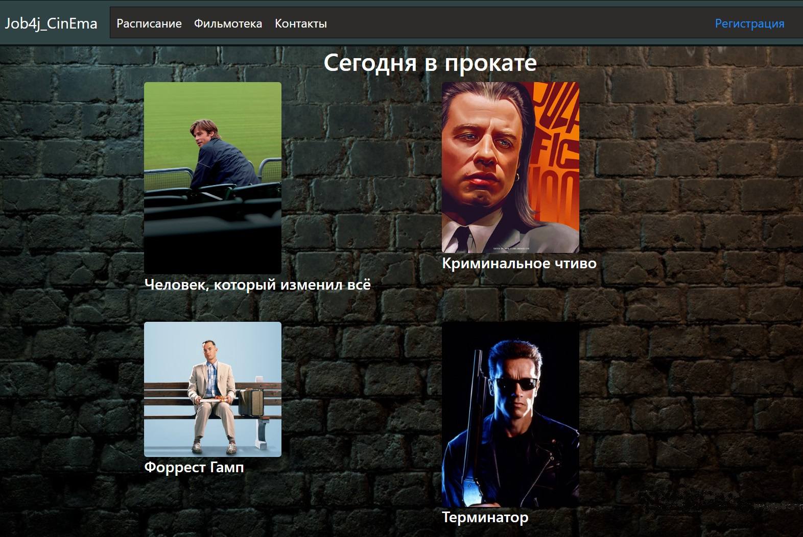
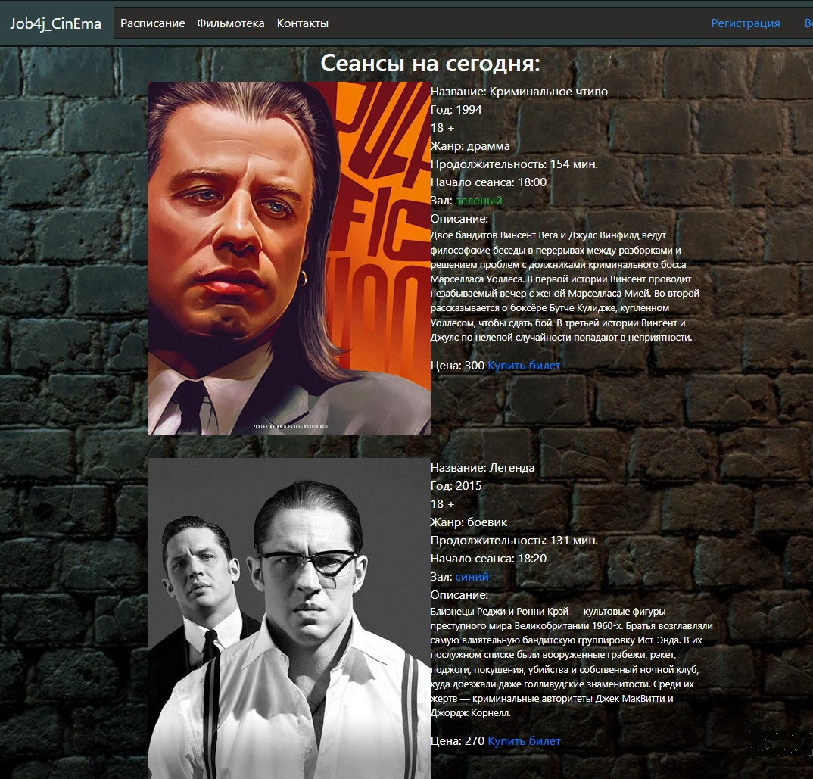
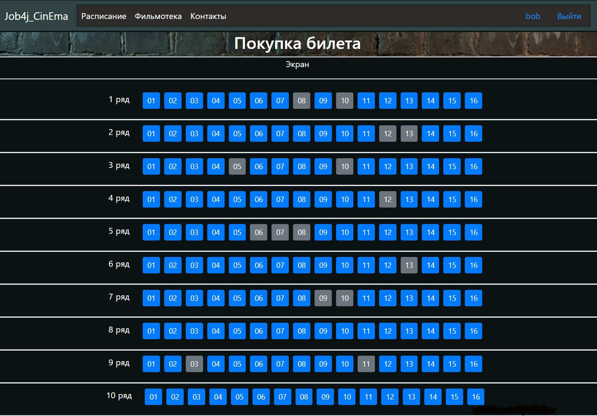

# Job4j_Cinema
Проект Job4j_Cinema представляет собой сервис покупки билетов в кинотеатр
и является обобщающим заданием по теме "Web" т.к. подобные ресурсы имеют 
много логики и при создании используется обширный стек технологий.
### В проекте используется:
* Java 17
* Spring Boot 3.1
* PostgreSQL 14
* Thymeleaf
* Bootstrap
* Liquibase
* Sql2o

Страница приветствия

Страница регистрации

Список фильмов

Страница сеансы

Выбор места/покупка

Информация о покупке билета

